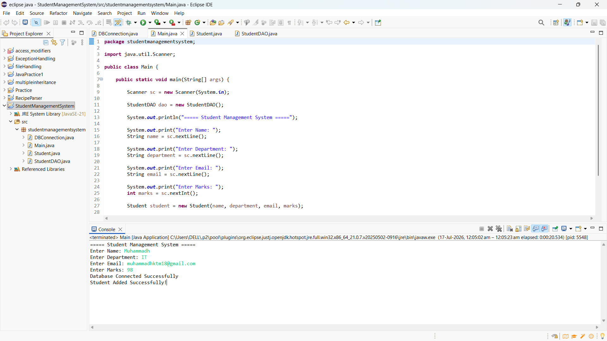
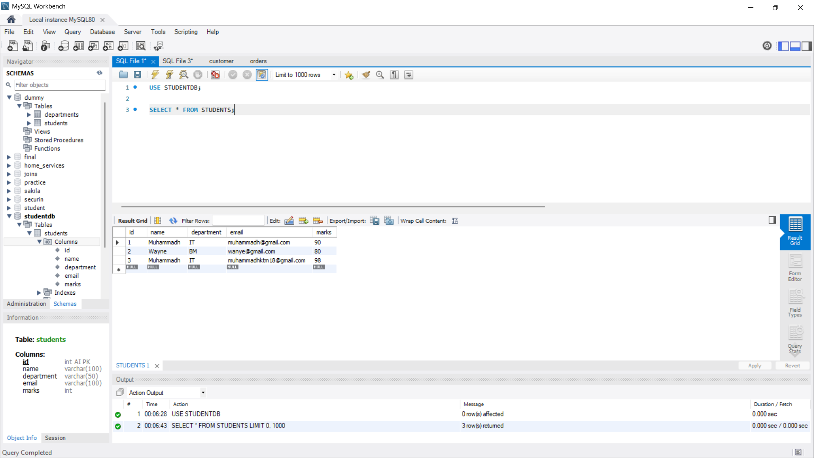

# 🎓 Student Management System

<p align="center">


</p>

---

## 📌 Project Overview

The **Student Management System** is a Java console application developed using **Java**, **JDBC**, and **MySQL**. It demonstrates how Java applications interact with relational databases by collecting student information through the console and storing it in a MySQL database.

This project was created to gain practical experience with **JDBC connectivity**, **SQL operations**, and **database integration** using Java.

---

## 🎯 Objectives

- Develop a Java console application
- Connect Java with MySQL using JDBC
- Store student records in a relational database
- Learn SQL INSERT operations
- Understand JDBC database connectivity
- Practice exception handling and database interaction

---

## ✨ Features

- 📝 Accept student details from the console
- 🔗 Connect Java application with MySQL
- 💾 Store student records using JDBC
- ⚡ Execute SQL INSERT queries
- ✅ Display operation status messages
- ⚠ Handle database connection exceptions

---

## 🛠 Technologies Used

| Technology | Purpose |
|------------|---------|
| Java | Application Development |
| JDBC | Database Connectivity |
| MySQL | Relational Database |
| Eclipse IDE | Development Environment |
| Git | Version Control |
| GitHub | Repository Hosting |

---

## 📂 Project Structure

```text
StudentManagementSystem
│
├── images
│   ├── java-input.png
│   └── mysql-output.png
│
├── src
│   ├── Main.java
│   ├── Student.java
│   ├── StudentDAO.java
│   └── DBConnection.java
│
├── .classpath
├── .project
├── .gitignore
└── README.md
```

---

## 🗄 Database

The application stores student records in a MySQL database.

Example table structure:

```sql
CREATE TABLE student (
    id INT PRIMARY KEY,
    name VARCHAR(100),
    age INT,
    department VARCHAR(100)
);
```

> **Note:** Update the database URL, username, and password in `DBConnection.java` before running the application.

---

## 🚀 How It Works

1. Run the Java application.
2. Enter the student details through the console.
3. The application establishes a JDBC connection.
4. Student information is inserted into the MySQL database.
5. A confirmation message is displayed after successful insertion.

---

# 📸 Project Demonstration

## Java Console

<p align="center">

</p>

---

## MySQL Database Output

<p align="center">

</p>

---

## 💡 Concepts Demonstrated

- Object-Oriented Programming (OOP)
- JDBC Connectivity
- MySQL Integration
- SQL INSERT Statement
- PreparedStatement
- Exception Handling
- Java Database Connectivity

---

## 📈 Future Enhancements

- 👀 View all student records
- 🔍 Search student by ID
- ✏ Update student information
- ❌ Delete student records
- ✔ Input validation
- 🖥 GUI using Java Swing or JavaFX

---

## 👨‍💻 Author

**Muhammadh**

- GitHub: **https://github.com/Muhammadh1810**

---

## ⭐ Support

If you found this project useful, consider giving it a ⭐ on GitHub.
